⚡ Mohammed MEZO
<h3 align="center">
AOSP ROM Developer • Xiaomi / HyperOS ROM Builder • OnePlus Porter • ODM Porter • DeadZone Founder
</h3>
<p align="center">
  <a href="https://deadzone.web.id/">
    
  </a>
  <a href="https://t.me/xDeadZone">
    
  </a>
  <a href="https://t.me/DeadZoneDiscussion">
    
  </a>
  <a href="https://t.me/DeadZoneCloud">
    
  </a>
</p>
<p align="center">
  
  
  
</p>
---
🧠 About Me
I am Mohammed MEZO, an Android ROM developer focused on building, porting, optimizing, and automating custom Android systems.
My work is centered around AOSP ROM development, Xiaomi / HyperOS ROM customization, OnePlus device support, ODM porting, and building automation systems that make ROM delivery faster, cleaner, and more reliable.
🔥 Founder of DeadZone ROM
📱 AOSP ROM Developer
🧩 Xiaomi / HyperOS ROM Builder
⚙️ OnePlus ROM Porter
🛠️ ODM ROM Porter
🚀 ROM automation with GitHub Actions
🧪 SystemUI, framework, services, vendor and boot-level experiments
☁️ Cloud delivery, build notifications, device support and release workflows
---
🚀 DeadZone Ecosystem
Area	Link
🔥 Updates	DeadZone Updates
💬 Discussion	DeadZone Discussion
☁️ Cloud Builds	DeadZone Cloud
🌐 Website	deadzone.web.id
📱 Supported Devices	Devices List
👑 Owner	@MohamedMezo1
---
🎯 Main Focus
```txt
AOSP ROM Development        ████████████████████
Xiaomi / HyperOS ROMs       ████████████████████
OnePlus Device Porting      ██████████████████░░
ODM Porting                 ██████████████████░░
Android System Modding      ███████████████████░
GitHub Actions Automation   ███████████████████░
ROM Release Pipelines       ███████████████████░
```
---
🛠️ ROM Development Stack
Layer	Work
AOSP	Source-based ROM building, bring-up, debugging, system integration
Xiaomi / HyperOS	Stock ROM modification, feature routing, framework and SystemUI tweaks
OnePlus	Device porting, vendor adaptation, boot/system compatibility
ODM Porting	Cross-device system adaptation and vendor/ODM integration
Kernel / Boot	Boot image handling, root integration, KernelSU / SUSFS experiments
Automation	GitHub Actions, build matrix, upload system, live notifications
Release	ROM packaging, checksum, changelog, cloud mirrors, Telegram release flow
---
🧬 ROM Pipeline

```mermaid
flowchart LR
    A[ROM Source / OTA Link] --> B[Download & Verify]
    B --> C[Extract Payload / Images]
    C --> D[Detect Device & Platform]
    D --> E[Apply Base Patches]
    E --> F[Apply Feature Mods]
    F --> G[Vendor / ODM Compatibility]
    G --> H[Repack ROM]
    H --> I[Generate Hash]
    I --> J[Upload to Cloud]
    J --> K[Telegram Release]
```

---
🔥 Featured Work
Project Type	Description
DeadZone ROM	Custom Android ROM ecosystem focused on performance, style, and device support
Xiaomi ROM Factory	Automated tools for extracting, patching, repacking, and uploading Xiaomi / HyperOS builds
OnePlus Porting	Porting and compatibility work for OnePlus devices
ODM Porting	Vendor / ODM adaptation for cross-device ROM experiments
DeadZone Website	Public website for downloads, changelogs, screenshots, team, and device information
AI-assisted Development	AI coding agents and automation helpers for faster debugging and ROM workflows
---
📊 GitHub Stats
<p align="center">
  
  
</p>
---
🐍 Contribution Snake
<p align="center">
  <picture>
    <source media="(prefers-color-scheme: dark)" srcset="https://github.com/hypermezo4-create/hypermezo4-create/blob/output/github-contribution-grid-snake-dark.svg?raw=true">
    <source media="(prefers-color-scheme: light)" srcset="https://github.com/hypermezo4-create/hypermezo4-create/blob/output/github-contribution-grid-snake.svg?raw=true">
    
  </picture>
</p>
---
🌐 Connect With Me
<p align="center">
  <a href="https://t.me/MohamedMezo1">
    
  </a>
  <a href="https://t.me/xDeadZone">
    
  </a>
  <a href="https://deadzone.web.id/">
    
  </a>
</p>
---
<p align="center">
  <b>Build clean. Port smart. Release with confidence.</b>
</p>
