<p align="center">
  
</p>

<h1 align="center">⚡ Mohammed MEZO ⚡</h1>

<h3 align="center">
  AOSP ROM Developer • Xiaomi ROM Builder • OnePlus / ODM Porter • DeadZone Founder
</h3>

<p align="center">
  <a href="https://deadzone.web.id/">
    
  </a>
  <a href="https://t.me/xDeadZone">
    
  </a>
  <a href="https://t.me/DeadZoneDiscussion">
    
  </a>
  <a href="https://t.me/DeadZoneCloud">
    
  </a>
</p>

<p align="center">
  
  
  
</p>

<p align="center">
  
</p>

---

## 🧠 About Me

I am **Mohammed MEZO**, an Android ROM developer focused on building, porting, optimizing, and automating custom Android systems.

My work is centered around **AOSP ROM development**, **Xiaomi / HyperOS ROM customization**, **OnePlus device support**, **ODM porting**, and building automation systems that make ROM delivery faster, cleaner, and more reliable.

- 🔥 Founder of **DeadZone ROM**
- 📱 AOSP ROM Developer
- 🧩 Xiaomi / HyperOS ROM Builder
- ⚙️ OnePlus ROM Porter
- 🛠️ ODM ROM Porter
- 🚀 ROM automation with GitHub Actions
- 🧪 SystemUI, framework, services, vendor and boot-level experiments
- ☁️ Cloud delivery, build notifications, device support and release workflows

---

## 🚀 DeadZone Ecosystem

| Area | Link |
|---|---|
| 🔥 Updates | [DeadZone Updates](https://t.me/xDeadZone) |
| 💬 Discussion | [DeadZone Discussion](https://t.me/DeadZoneDiscussion) |
| ☁️ Cloud Builds | [DeadZone Cloud](https://t.me/DeadZoneCloud) |
| 🌐 Website | [deadzone.web.id](https://deadzone.web.id/) |
| 📱 Supported Devices | [Devices List](https://t.me/DeadZoneDiscussion/3961) |
| 👑 Owner | [@MohamedMezo1](https://t.me/MohamedMezo1) |

---

## 🎯 Main Focus

```txt
AOSP ROM Development        ████████████████████
Xiaomi / HyperOS ROMs       ████████████████████
OnePlus Device Porting      ██████████████████░░
ODM Porting                 ██████████████████░░
Android System Modding      ███████████████████░
GitHub Actions Automation   ███████████████████░
ROM Release Pipelines       ███████████████████░
```

---

## 🛠️ Tech Arsenal

<p align="center">
  
</p>

---

## ⚙️ ROM Development Stack

| Layer | Work |
|---|---|
| **AOSP** | Source-based ROM building, bring-up, debugging, system integration |
| **Xiaomi / HyperOS** | Stock ROM modification, feature routing, framework and SystemUI tweaks |
| **OnePlus** | Device porting, vendor adaptation, boot/system compatibility |
| **ODM Porting** | Cross-device system adaptation and vendor/ODM integration |
| **Kernel / Boot** | Boot image handling, root integration, KernelSU/SUSFS experiments |
| **Automation** | GitHub Actions, build matrix, upload system, live notifications |
| **Release** | ROM packaging, checksum, changelog, cloud mirrors, Telegram release flow |

---

## 🧬 ROM Pipeline

```mermaid
flowchart LR
    A[ROM Source / OTA Link] --> B[Download & Verify]
    B --> C[Extract Payload / Images]
    C --> D[Detect Device & Platform]
    D --> E[Apply Base Patches]
    E --> F[Apply Style / Feature Mods]
    F --> G[Vendor / ODM Compatibility]
    G --> H[Repack ROM]
    H --> I[Generate Hash]
    I --> J[Upload to Cloud]
    J --> K[Telegram Release]
```



---

## 🔥 Featured Work

| Project Type | Description |
|---|---|
| **DeadZone ROM** | Custom Android ROM ecosystem focused on performance, style, and device support |
| **Xiaomi ROM Factory** | Automated tools for extracting, patching, repacking, and uploading Xiaomi / HyperOS builds |
| **OnePlus Porting** | Porting and compatibility work for OnePlus devices |
| **ODM Porting** | Vendor / ODM adaptation for cross-device ROM experiments |
| **DeadZone Website** | Public website for downloads, changelogs, screenshots, team, and device information |
| **AI-assisted Development** | Using AI coding agents and local routing tools to speed up ROM debugging and automation |

---

## 📊 GitHub Stats

<p align="center">
  
  
</p>

<p align="center">
  
</p>

---

## 🏆 Trophies

<p align="center">
  
</p>

---

## 🐍 Contribution Snake

<p align="center">
  
</p>

---

## 🌐 Connect With Me

<p align="center">
  <a href="https://t.me/MohamedMezo1">
    
  </a>
  <a href="https://t.me/xDeadZone">
    
  </a>
  <a href="https://deadzone.web.id/">
    
  </a>
</p>

---

<p align="center">
  <b>“Build clean. Port smart. Release with confidence.”</b>
</p>

<p align="center">
  
</p>
 
